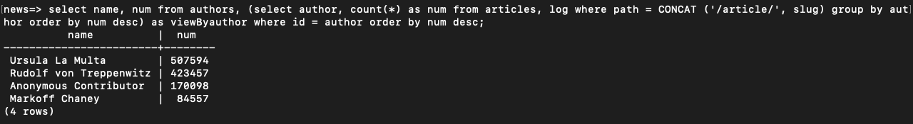
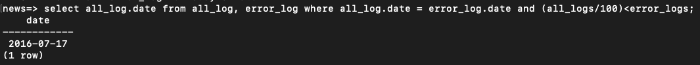

# Welcom

#### This program requres you to only run the script and three answerd question will showup based on the provided database.

### The Three Questions are: 

#### 1. What are the most popular three articles of all time?
select title, num from articles, (select path, count(*) as num from log group by path order by num desc limit 3 offset 1) as top3 where path like CONCAT ('%', slug) order by num desc;

#### 2. Who are the most popular article authors of all time?
select name, num from authors, (select author, count(*) as num from articles, log where path = CONCAT ('/article/', slug) group by author order by num desc) as viewByauthor where id = author order by num desc;

#### 3. On which days did more than 1% of requests lead to errors?
select all_log.date from all_log, error_log where all_log.date = error_log.date and (all_logs/100)<error_logs;

### Also two views were used to analays the database inorder to answer the later questions:

#### View all_log 
create view all_log as select Date(time), count(*) as all_logs from log group by Date(time);

#### View error_log
create view error_log as select Date(time), count(*) as Error_logs from log  where status like concat('40', '%') group by Date(time);
