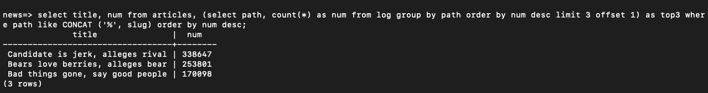
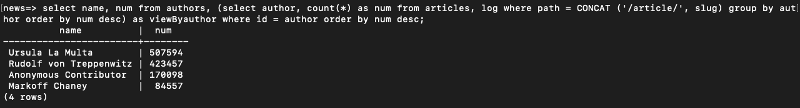
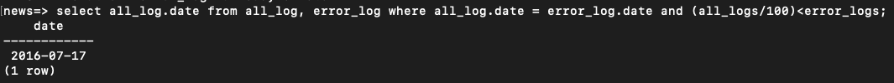

# Log Analays
## Project of Udacity Fullstack Web Development Nanodegree

### Pre-Requisites and Environment Preparation
#### First (get resources from the web)
- Download Git : https://git-scm.com/downloads
- Download Virtual Box :  https://www.virtualbox.org/wiki/Download_Old_Builds_5_1
- Download Vagrant : https://www.vagrantup.com/downloads.html
- fork this repository : https://github.com/udacity/fullstack-nanodegree-vm

#### Second (set up Environment using Terminal)
- clone the forked repository
- cd into the repository
- cd again into the vagrant file
- clone this repository
- Download this database : https://d17h27t6h515a5.cloudfront.net/topher/2016/August/57b5f748_newsdata/newsdata.zip
- unzipp the database please :)
- move the data base into the working repository
- in the terminal please run this command : psql -d news -f newsdata.sql

#### Third (Running the Virtual machine)
In order to complete these steps you have to be inside vagrant file
- Type the command : vagrant up
- Type the command : vagrant ssh
- Type the command : cd /vagrant/item_catalog

#### Fourth (Run the Actual WebApplication)
- Type the command : python log2.py
- Read the results :)

### The Three Questions:

#### 1. What are the most popular three articles of all time?

`select title, num from articles, (select path, count(*) as num from log group by path order by num desc limit 3 offset 1) as top3 where path like CONCAT ('%', slug) order by num desc;`

#### 2. Who are the most popular article authors of all time?
`select name, num from authors, (select author, count(*) as num from articles, log where path = CONCAT ('/article/', slug) group by author order by num desc) as viewByauthor where id = author order by num desc;`

#### 3. On which days did more than 1% of requests lead to errors?
`select all_log.date from all_log, error_log where all_log.date = error_log.date and (all_logs/100)<error_logs;`

### The Views:

#### View all_log
`create view all_log as select Date(time), count(*) as all_logs from log group by Date(time);`

#### View error_log
`create view error_log as select Date(time), count(*) as Error_logs from log  where status like concat('40', '%') group by Date(time);`
